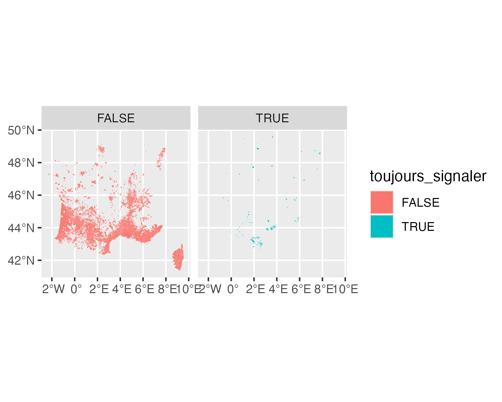

<!-- README.md is generated from README.Rmd. Please edit that file -->

# alboFr

<!-- badges: start -->

[](https://lifecycle.r-lib.org/articles/stages.html#experimental)
[](https://CRAN.R-project.org/package=alboFr)
<!-- badges: end -->

The goal of `alboFr` is to retrieve the latest online data from <a
href="https://signalement-moustique.anses.fr/signalement_albopictus/colonisees"
target="_blank">https://signalement-moustique.anses.fr/signalement_albopictus/colonisees</a>
and convert them into an `sf` object.

## Installation

You can install the development version of `alboFr` from R-universe
with:

``` r
install.packages("alboFr",
  repos = c("https://e-kotov.r-universe.dev",
    "https://cloud.r-project.org"
  )
)
```

You can also install the development version of `alboFr` from
[GitHub](https://github.com/e-kotov/alboFr) with:

``` r
# install.packages("pak")
pak::pak("e-kotov/alboFr")
```

## Example with `sf` data type

The package only has one function to get the data:

``` r
library(alboFr)

x_sf <- get_tiger_mosquito_colonisation_in_france(output = "sf")
```

``` r
head(x_sf)
```

    Simple feature collection with 6 features and 1 field
    Geometry type: POLYGON
    Dimension:     XY
    Bounding box:  xmin: 1.195249 ymin: 42.99451 xmax: 7.835923 ymax: 48.64427
    Geodetic CRS:  WGS 84
      toujours_signaler                       geometry
    1              TRUE POLYGON ((7.77076 48.49202,...
    2              TRUE POLYGON ((1.987127 42.99451...
    3              TRUE POLYGON ((1.584032 44.76673...
    4              TRUE POLYGON ((1.249545 44.34751...
    5              TRUE POLYGON ((2.566791 43.02245...
    6              TRUE POLYGON ((3.502814 43.97531...

The data can then be plotted:

``` r
library(ggplot2)
p <- ggplot(x_sf) +
  geom_sf(aes(fill = toujours_signaler), col = NA) +
  facet_wrap(~toujours_signaler)
p
# ggsave(
#   filename = "man/figures/map.png",
#   plot = p,
#   width = 5,
#   height = 4,
#   units = "in",
#   dpi = 300
# )
```



Finally the data can be saved to a GeoPackage file:

``` r
library(sf)
st_write(x_sf, "tiger_mosquito_colonisation_in_france.gpkg")
```

## Example without `sf` data type

You do not have to have `sf` package installed to use {`alboFr`}. You
can just retrieve the data in `geojson` format and save it directly to
disk bypassing the `sf` object creation:

``` r
x_geojson <- get_tiger_mosquito_colonisation_in_france(output = "geojson")
writeLines(x_geojson, "tiger_mosquito_colonisation_in_france.geojson")
```

## Data license

The original data does not have a well defined license, but the legal
matters regarding this data can be found here:
<https://signalement-moustique.anses.fr/signalement_albopictus/mentionslegales>.

## Citation

To cite package ‘alboFr’ in publications use:

Kotov E (2025). *alboFr: Get French Data on Tiger Mosquito
Colonisation*. <https://github.com/e-kotov/alboFr>.

BibTeX:

    @Manual{albofr,
      title = {alboFr: Get French Data on Tiger Mosquito Colonisation},
      author = {Egor Kotov},
      year = {2025},
      url = {https://github.com/e-kotov/alboFr},
    }
